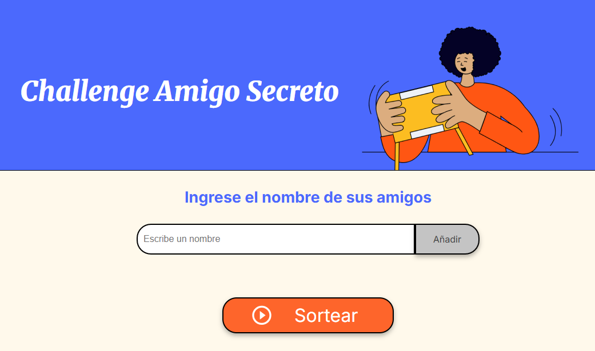

# Challenge Amigo Secreto 🎁

Esta es una aplicación que permite ingresar nombres de amigos en una lista para luego realizar un sorteo aleatorio y determinar quién es el Amigo Secreto.

## Funcionalidades ⚙️

- ✍️**Agregar nombres:** Los usuarios pueden ingresar nombres de sus amigos en un campo de texto y hacer click en **Añadir** para agregarlos a una lista.

- ❗**Validación de entrada:** Si el campo de texto está vacío o contiene caracteres no válidos, la aplicacion mostrará una alerta solicitando un nombre válido.

- 👀**Visualización dinámica:** Aparecerá una lista debajo del campo de entrada que se actualizará conforme se ingresen los nombres.

- 🎲**Sorteo aleatorio:** Al hacer clic en el botón **Sortear**, la aplicación seleccionará aleatoriamente un nombre de la lista y lo mostrará en pantalla.
